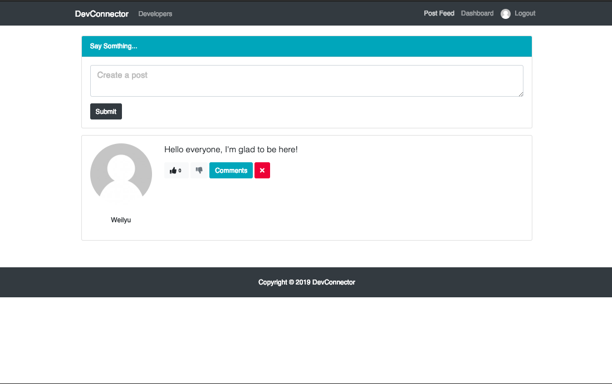

# DevConnector

A platform for developers to connect. They can create their portofolio by adding their experience, education, skills and other important information of their professional career. Users can also create small posts and like/dislike and comment on other posts.

You can visit the website simply by clicking <a href="https://glacial-island-91015.herokuapp.com/" target="_blank">here</a>.





---


## To run locally

```bash
# Install dependencies for server
npm install

# Install dependencies for client
npm run client-install

# Run the client & server with concurrently
npm run dev

# Run the Express server only
npm run server

# Run the React client only
npm run client

# Server runs on http://localhost:5000 and client on http://localhost:3000
```

You will need to create a keys_dev.js in the server config folder with

```
module.exports = {
  mongoURI: 'YOUR_OWN_MONGO_URI',
  secretOrKey: 'YOUR_OWN_SECRET'
};
```

## Main Technologies used

### Client Side

- **[React](https://github.com/facebook/react)**
- **[Redux](https://github.com/reactjs/redux)**
- **[Twitter Bootstap 4](https://github.com/twbs/bootstrap/tree/v4-dev)**
- **[React-Router-DOM](https://github.com/ReactTraining/react-router/tree/master/packages/react-router-dom)**

#### Libraries used in Client-side

- **[axios](https://github.com/axios/axios)**
- **[classnames](https://github.com/JedWatson/classnames)**
- **[react-moment](https://github.com/headzoo/react-moment)**
- **[react-redux](https://github.com/reduxjs/react-redux)**
- **[redux-thunk](https://github.com/reduxjs/redux-thunk)**
- **[validator](https://github.com/chriso/validator.js)**

### Server Side

- **[Express](https://github.com/expressjs/express)**
- **[MongoDB](https://github.com/mongodb/mongo)**
- **[JWT](https://github.com/auth0/node-jsonwebtoken)**
- **[Passport](http://www.passportjs.org/)**
- **[Passport-jwt](https://github.com/themikenicholson/passport-jwt)**

#### Libraries used in Server-side

- **[bcryptjs](https://github.com/dcodeIO/bcrypt.js)**
- **[gravatar](https://github.com/emerleite/node-gravatar)**
- **[mongoose](http://mongoosejs.com/)**
- **[jwt-decode](https://github.com/auth0/jwt-decode)**
- **[moment](https://momentjs.com/)**
- **[validator](https://github.com/chriso/validator.js)**

### Version

1.0.0

### License

This project is licensed under the MIT License

